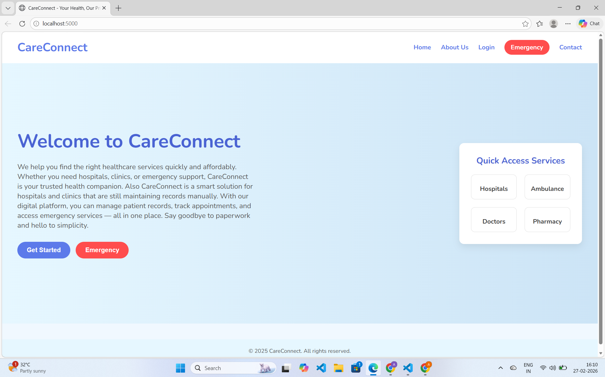
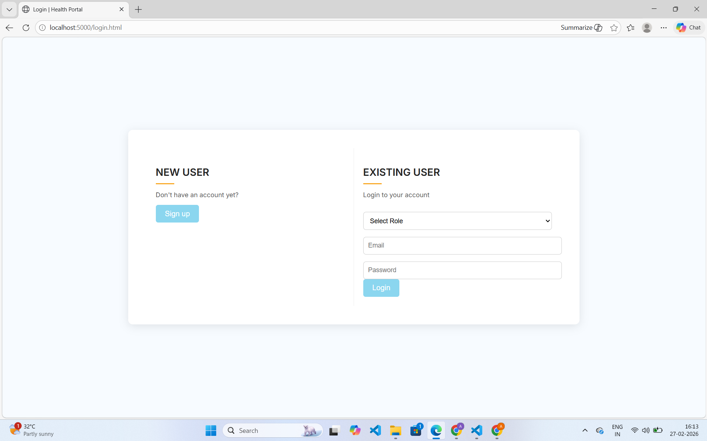
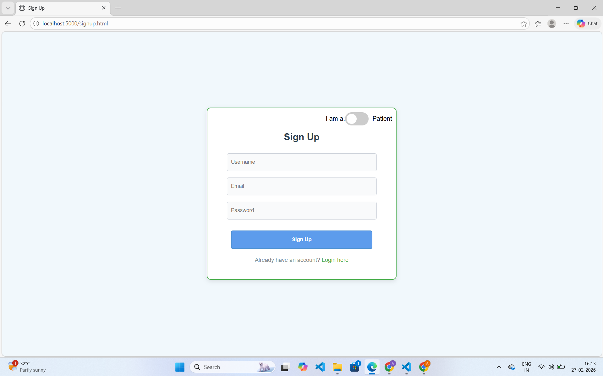
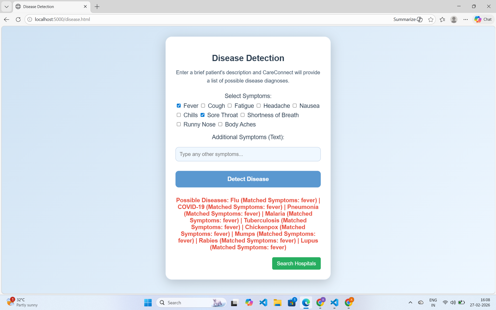
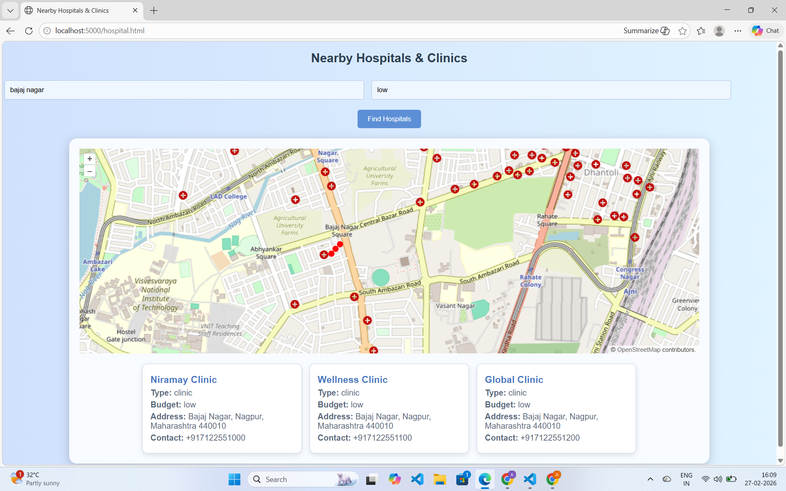
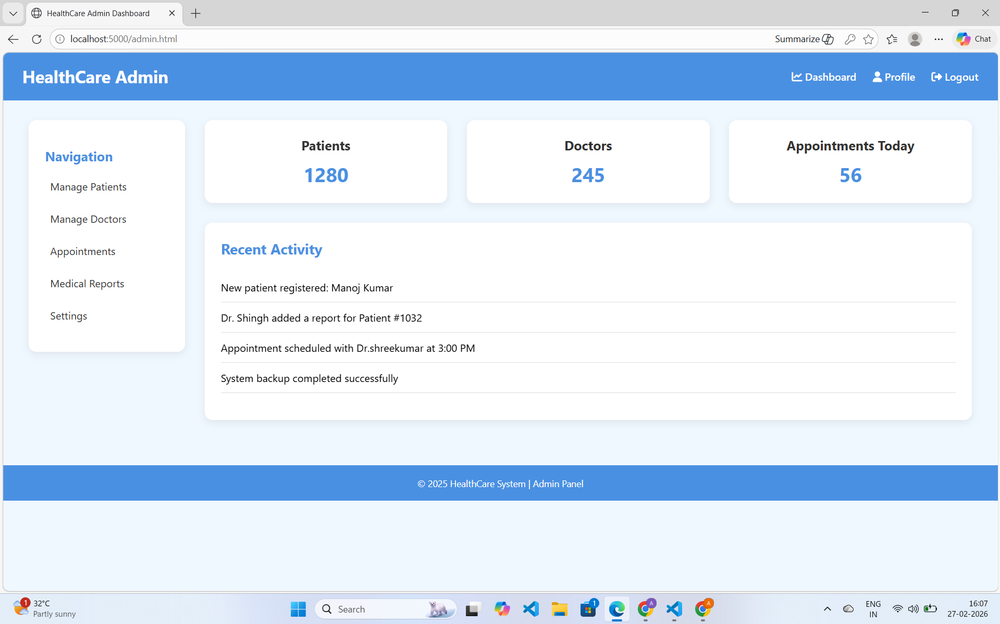
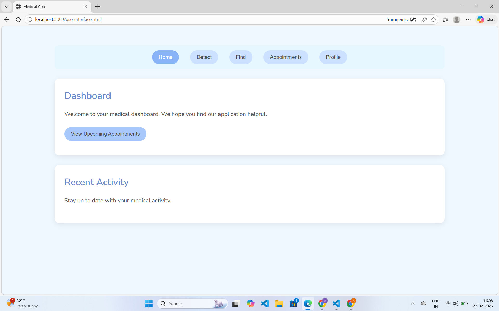
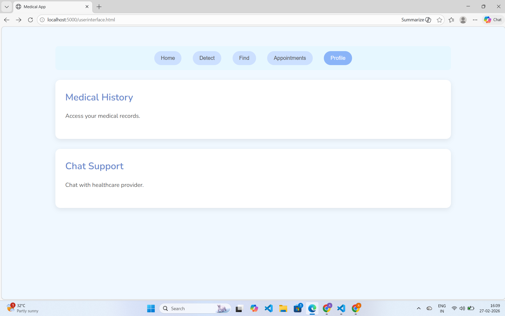

# 🏥 CareConnect – Smart Healthcare Web Application

CareConnect is a full-stack healthcare web platform designed to help users easily:

* 🔍 Detect diseases based on symptoms
* 🏥 Find hospitals based on location & budget
* 👤 Manage personal health access through login system

This project focuses on building a **real-world healthcare solution** using Flask backend and interactive frontend.

---

## 🚀 Features

✅ User Signup & Login System
✅ Disease Detection Module
✅ Hospital Locator (Location + Budget Based)
✅ Interactive UI
✅ Secure Data Handling
✅ JSON-based Disease Database
✅ SQLite-based User Data Storage
✅ OpenLayers Map Integration

---

## 🛠 Tech Stack

| Layer        | Technology Used                |
| ------------ | ------------------------------ |
| Frontend     | HTML, CSS, JavaScript          |
| Backend      | Flask (Python)                 |
| Database     | SQLite (healthcare.db)         |
| Disease Data | MongoDB (for detection module) |
| Maps         | OpenLayers                     |
| Data Format  | JSON                           |

---

## 📂 Project Structure

```
CareConnect/
│── static/
│── templates/
│── healthcare.db
│── app.py
│── requirements.txt
│── README.md
```

---

## ⚙️ How to Run Locally

1️⃣ Clone the repository

```
git clone https://github.com/YOUR_USERNAME/CareConnect.git
```

2️⃣ Navigate to project folder

```
cd CareConnect
```

3️⃣ Install dependencies

```
pip install -r requirements.txt
```

4️⃣ Run Flask App

```
python app.py
```

5️⃣ Open in browser

```
http://127.0.0.1:5000
```

---

## 🎯 Project Goal

To simplify healthcare accessibility by:

* Enabling early disease awareness
* Helping users find affordable nearby hospitals
* Providing a user-friendly medical support platform

---

## 💡 Future Enhancements

🔹 AI-based Disease Prediction
🔹 Doctor Appointment Booking
🔹 Emergency Service Integration
🔹 Health Report Upload

---

## 👩‍💻 Developed By

**Aashi Kohad**

B.Tech CSE student


---

## ⭐ If you like this project, give it a star!


## 📸 Project Preview

### 🏠 Homepage


### 🔐 Login Page


### 📝 Signup Page


### 🧠 Disease Detection


### 🏥 Hospital Finder


### 👨‍⚕️ Doctor Dashboard


### 🧑 Patient Dashboard


### 👤 Patient Profile
